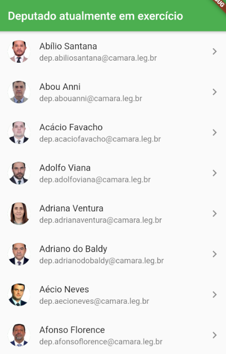
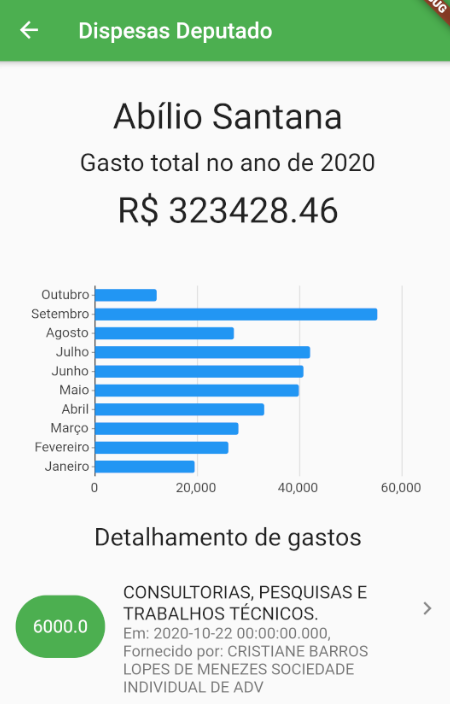

# Despesas anuais dos deputados

Aplicativo para visualização da despesa dos deputados disponibilizados pela Câmara dos Deputados a respeito de seus relativos gastos anuais.

Estes dados são dados disponibilizados abertamente à população e estão disponíveis no seguinte endereço: [Fonte](https://dadosabertos.camara.leg.br/)

Trabalho final relativo a matéria Optativa 2 - Desenvolvimento mobile, do Instituto Federal de Brasília, Campus Taguatinga.

# Telas

    
    

